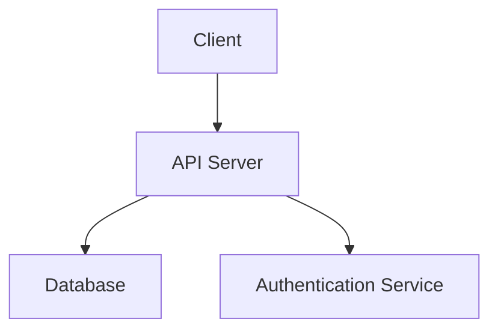

<style>
/* Custom Marp theme */
section {
  font-family: 'Segoe UI', sans-serif;
  color: #222;
}
h1 {
  color: #004b8d;
}
footer {
  font-size: 0.7rem;
  color: #666;
}
</style>

# **Technical Documentation Overview**

### Author: [23f2004405@ds.study.iitm.ac.in](mailto:23f2004405@ds.study.iitm.ac.in)

---

# **Why Marp for Documentation?**

- Markdown-based → version control friendly
- Export to PDF, PPTX, HTML
- Custom themes, backgrounds, math, and more

---

# **System Architecture**



---

# **Algorithmic Complexity**

For a search operation using binary search:

$$
T(n) = O(\log n)
$$

For nested loops running (n) times:

$$
T(n) = O(n^2)
$$

---

<!-- Slide with background image -->

<!-- Replace the URL with any public background image -->

<!--backgroundImage: url('https://images.unsplash.com/photo-1518770660439-4636190af475')
backgroundSize: cover
backgroundPosition: center
-->

<!-- Background image -->


# **Product Workflow**

---

# **Custom Styling Example**

<div style="background:#eef7ff; padding:20px; border-left:6px solid #004b8d;">
This is a custom-styled callout using inline HTML inside Marp.
</div>

---

# **Contact**

### [23f2004405@ds.study.iitm.ac.in](mailto:23f2004405@ds.study.iitm.ac.in)

---

# **GitHub Raw URL Format**

To host this file on GitHub, the raw URL will be:

```
https://raw.githubusercontent.com/[USER]/[REPO]/main/slides.md
```
